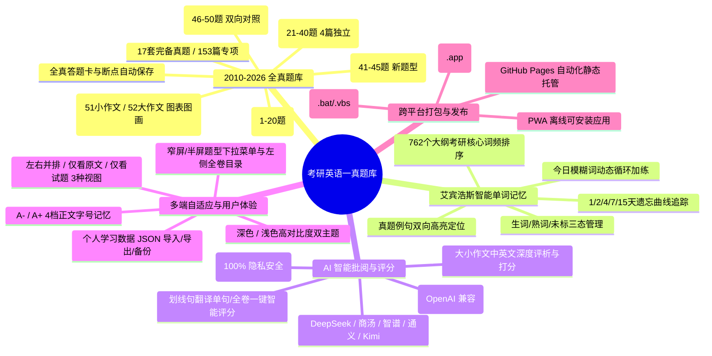

# 考研英语一真题库 · 项目全景进度与技术架构总结

> **最后更新时间**：2026年9月19日  
> **项目版本**：v1.2.0 (Continuous Delivery)  
> **线上访问地址**：[https://xixigod7.github.io/kaoyan-english/](https://xixigod7.github.io/kaoyan-english/)  
> **开源代码仓库**：[https://github.com/XixiGod7/kaoyan-english](https://github.com/XixiGod7/kaoyan-english)

---

## 📌 一、 项目定位与核心愿景

**「考研英语一真题库 (Kaoyan English)」** 是一套专为全国硕士研究生招生考试（英语一）考生深度打造的**全功能、纯离线、智能化备考系统**。
项目整合了 2010–2026 年近 17 年的全部真题卷与 762 个高频大纲词汇，融合**艾宾浩斯遗忘曲线复习算法**、**多厂商大模型（OpenAI/DeepSeek/智谱/通义/商汤等）AI 写作与翻译精细化批阅**、以及**自适应全屏/分屏响应式排版**，支持 Web 端、PWA、Windows 绿色版与 macOS DMG 桌面客户端全平台开箱即用。

---

## 🎯 二、 核心功能模块与建设全景



---

## ⏱️ 三、 项目里程碑与各阶段演进

### 阶段一：基础题库建设与全题型交互交互还原 (v1.0.0)
- **17 套真题数据精细化清洗与结构化**：收录 2010–2026 年英语一真题，拆解为独立题块（完形、阅读 1-4、新题型、翻译、大小作文）；
- **全真题交互式答题卡**：52 题统一编号，做题状态联动显示，答案与倒计时实时自动持久化在本地浏览器（`localStorage`）；
- **艾宾浩斯智能单词复习模块**：收录 762 个高频考点词汇，结合遗忘曲线复习法实现每日科学复习排程；
- **全平台打包交付**：构建 PWA 离线支持，制作 Windows 离线包与 macOS `.dmg` 独立应用程序包。

### 阶段二：AI 大模型写作与翻译智能批阅生态 (v1.1.0)
- **多模型支持与厂商预设**：
  - 预设厂商包括：**DeepSeek（深度求索）**、**OpenAI**、**Moonshot Kimi**、**阿里通义千问**、**智谱 GLM**、**本地 Ollama（完全离线）**、**商汤日日新 (SenseNova)** 及自定义第三方中转；
- **大小作文权威评分与纠错**：
  - 小作文（Part A 10分）：严格根据格式、要点完整度、语域语气进行维度评分与语法润色；
  - 大作文（Part B 20分）：图画/图表精准立意分析、论证逻辑深度、高分词句替换与全真估分；
- **英译汉智能批阅**：
  - 支持第 46–50 题单句即时评析，支持一键整卷批量批阅；
- **100% 隐私保障**：
  - API Key 仅保存在客户端本地，请求直接由浏览器发起，绝不经过任何第三方中间服务器。

### 阶段三：全窗口自适应缩放与多端排版重构 (体验攻坚)
- **修复双导航栏与高度溢出**：
  - 做题模式下隐藏全局顶栏，采用单行自适应紧凑工具条；修复 `100vh + 56px` 导致的多重滚动条与交卷按钮遮挡问题；
- **重构三种做题视图模式**：
  - `[并排]` 模式：左文右题对照（宽屏首选）；
  - `[原文]` 模式：100% 满宽沉浸式阅读文章；
  - `[试题]` 模式：100% 满宽快速作答与复查；
- **字号 4 档无级调节 (`A- / A+`)**：
  - 动态切换 14px / 16px / 18px / 20px，并在刷新后保持学员偏好；
- **根治选项挤压与排版空隙**：
  - 并排模式下自适应为单列舒适布局，杜绝单词截断换行；
  - 移除导致英文大间隙的 `text-justify`，采用国际出版标准的 `text-left leading-relaxed break-words`；
- **答题卡抽屉化（Drawer）**：
  - 宽屏停靠侧边栏，笔记本与窄屏默认收起，点击以滑动抽屉展示，避免抢占阅读视野。

### 阶段四：最新迭代（今日完成交付）
1. **精简交互与做题沉浸化重构**：
   - **顶栏自适应下拉菜单 (Section Selector Dropdown)**：在窄屏/分屏（< 1280px）下，自动用下拉按钮 `[ 📖 当前题型 ▾ ]` 取代被挤压变形的横向长滚动条，一键弹出 9 大题型卡片、分数与完成进度；
   - **去除重复功能与边栏干扰**：删除与题型下拉菜单功能重叠的左侧试题目录抽屉，删除挤占视野的右侧答题卡侧栏与悬浮柄；
   - **进度集成于交卷按钮**：作答进度（如 `交卷 (5/52)`）直接整合至交卷按钮，做题视野 100% 满宽沉浸；
2. **商汤日日新 (SenseNova) 快捷模型扩充与优化**：
   - 快捷模型选择列表中加入 **`deepseek-v4-flash`** 和 **`deepseek-v4-pro`**，并将 **`deepseek-v4-flash`** 设为首选默认模型；
   - 移除旧版本强制覆写为 flash-lite 的逻辑；
   - API 配置弹窗中输入/粘贴 SenseNova 接口地址时实现智能自动联动识别；
3. **线上无缝部署**：
   - 代码同步推送至 GitHub `main` 分支；
   - 执行部署脚本同步全量更新至 GitHub Pages。

### 阶段五：全新首页导航、精读自然段重构、侧边栏折叠与生词本深度打通 (v1.2.0)
1. **全新高水准官方首页 (HomeView)**：
   - Hero 视觉引导区、6 大核心备战专区导航卡片（逐句精读、全真模考、词汇盲区速测、艾宾浩斯抗遗忘、英译汉实战、考研写作）、专项提分矩阵及数据监控中心；
   - 顶栏增设「首页」导航项，点击品牌名称与 Logo 无缝返回首页；
2. **长难句逐句精读自然段重构**：
   - 以自然段落为排版单元聚合长难句，极大增强英文阅读沉浸感与上下文连贯性；
   - 语法树逐层拆解与高亮分析、顺读生词门槛动态评测；
3. **AI 思考过程折叠与 Markdown 渲染**：
   - AI 答疑与批阅中思考过程默认优雅折叠，答复正文全面支持 Markdown 排版高亮渲染；
4. **全局字号缩放系统升级**：
   - 顶栏统一部署 `[ A-  SM/BASE/LG/XL  A+ ]` 胶囊组件，全站内容视图与做题视图等比缩放响应；
5. **全真模考词汇侧边栏向左折叠**：
   - 762 考频词汇区支持一键向左收拢为 58px 紧凑导轨，留出更多卷面空间，折叠偏好自动持久化；
6. **全真模考词汇区与顶部艾宾浩斯生词本深度联动打通**：
   - 彻底终结两套生词本数据隔离的暗坑，实现双向实时无缝同步；
   - 模考区标生词直接推入今日艾宾浩斯复习队列首位，标熟词自动设为永久掌握；
   - 艾宾浩斯背词卡片流转结果即时回流更新词汇区状态与考频标记。

---

## 💻 四、 技术架构与选型明细

| 架构层级 | 技术选型 | 说明与优势 |
| :--- | :--- | :--- |
| **前端核心框架** | **React 18.3 + TypeScript 5.6** | 高度组件化开发，强类型保证题库数据与作答状态严密无误 |
| **样式与排版** | **Tailwind CSS 3.4** | 原子化样式，支持深色/浅色高对比度主题切换与全端响应式流式布局 |
| **构建工具** | **Vite 5.4 + vite-plugin-singlefile** | 极速秒级 HMR 开发体验，生产环境支持打包为单文件单 HTML 离线包 |
| **图标库** | **Lucide React** | 统一、现代的矢量图标系统 |
| **数据持久化** | **Web Storage API (localStorage)** | 客户端本地持久化存储，无需数据库服务端即可实现 100% 学习记录不丢失 |
| **AI 接口协议** | **OpenAI Compatible REST API** | 标准化 Chat Completions 协议，实现多大模型厂商一键无缝接入 |
| **自动化发布** | **Python + Git Subprocess + GitHub Pages** | 自动化单文件打包、资源同步与 gh-pages 分支热更新推送 |

---

## 📊 五、 数据资产统计

- **考研真题年份跨度**：2010 年 至 2026 年（连续 17 年完整统考真题）
- **真题专项与材料总数**：153 篇独立考试材料与题组
- **客观题题库总数**：45 题 × 17 年 = 765 道全真试题
- **主观题题库总数**：7 题（5篇英译汉长句 + 2篇写作）× 17 年 = 119 篇主观表达
- **大纲核心词汇总数**：762 个高频考查词（全部配备历年真题例句、真题考点语境与考查频次）
- **真题扫描原图缩略图**：153 张高清真题切片缩略图

---

## 🚀 六、 常用开发与构建指令速查

```bash
# 1. 启动本地开发服务 (支持 HMR 热更新)
npm run dev

# 2. 生产环境单文件构建 (打包至 dist/index.html)
npm run build

# 3. 本地预览生产构建产物
npm run preview

# 4. 一键同步部署到 GitHub Pages
python scripts/deploy_gh_pages.py

# 5. 全平台离线包与 macOS DMG 打包
npm run package
```

---

## 🔮 七、 后续迭代规划展望

1. **生词本错题联动**：在答题记录中一键将错题涉及的长难句与词汇收录进个人复习生词本；
2. **AI 朗读与发音评测**：接入 Web Speech API 或大模型语音接口，支持长难句磨耳朵与正宗英美音发音跟读；
3. **作文模板库与句式仿写**：提供历年经典高分母题模板与功能句段对比练习系统。
